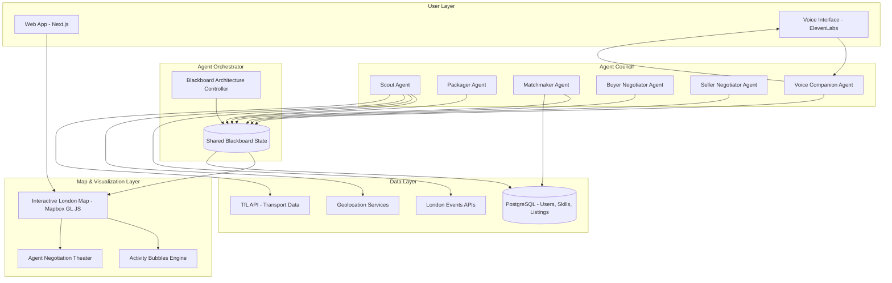
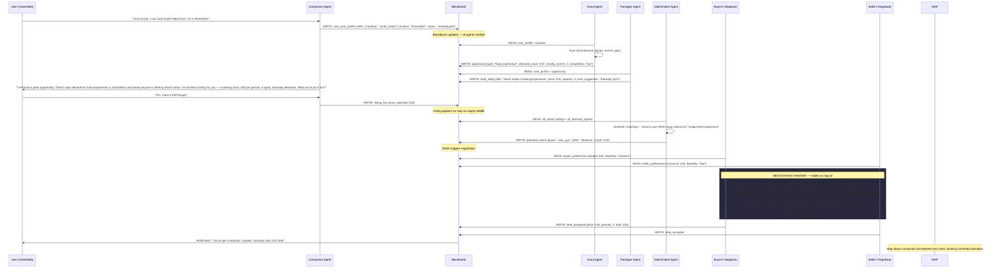
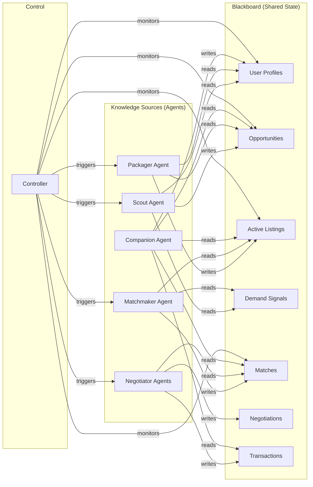
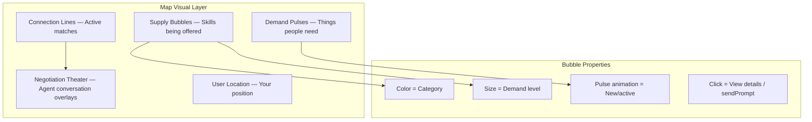
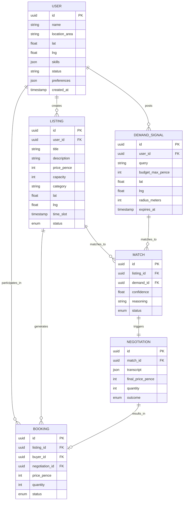
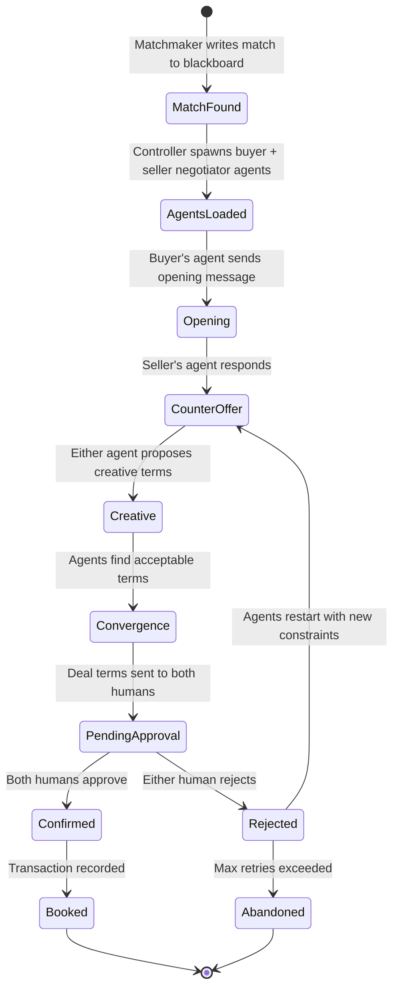
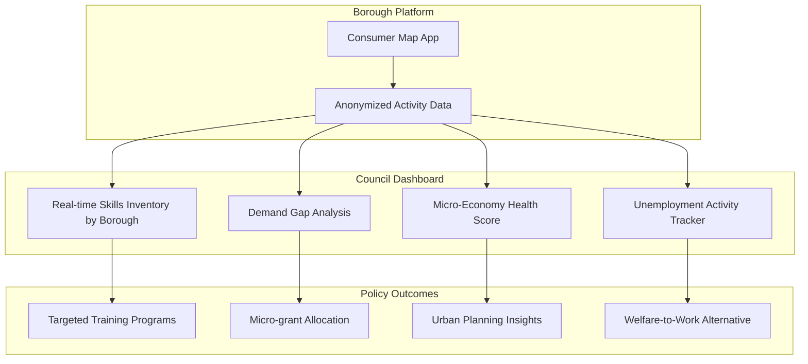
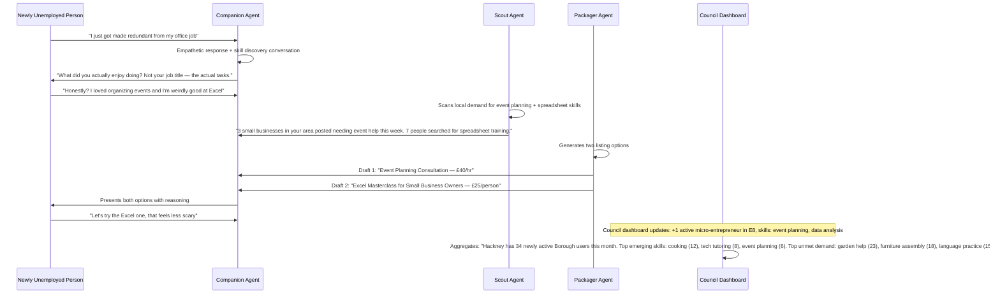

# Borough — Product Requirements Document

> **Hackathon:** Define The Future of (No) Work | March 15, 2026
> **Track:** Track 1 (Human Flourishing) with Track 2 (Public Systems) alignment
> **Team:** Devansh Karia
> **Version:** 1.0

---

## 1. The Problem

Work is disappearing. AI is automating services jobs across London — the city most dependent on them. When work vanishes, people lose three things simultaneously:

1. **Income** — No salary, no gig fallback (gigs are being automated too)
2. **Purpose** — No projects, no deadlines, no reason to get up
3. **Community** — No colleagues, no watercooler, no social fabric

The gig economy was the bridge between traditional employment and full automation. But that bridge is also collapsing. Uber, Deliveroo, and TaskRabbit are all deploying AI agents. The question becomes: **what economic model exists when both traditional jobs AND gig platforms are automated?**

**Answer: Hyper-local, human-first micro-economies — brokered by AI agents.**

---

## 2. The Solution: Borough

Borough is a real-time, map-based platform where AI agents help unemployed and underemployed Londoners discover, package, price, and trade skills and micro-services with their neighbors. It turns free time into a thriving local economy.

### Core thesis

> In a post-work London, the most valuable economic unit isn't a job — it's a skill shared between neighbors. AI agents don't replace this human exchange — they make it frictionless.

---

## 3. Track Alignment

### Track 1: Human Flourishing

Borough directly addresses the prompt: *"Build an agentic product that takes a real person in London from screen time to real-world action."*

- User goes from doomscrolling → talking to voice agent → listing a skill → meeting a neighbor → earning income
- Full end-to-end flow from digital isolation to physical connection + economic activity

### Track 2: Public Systems — The Unemployment Angle

Borough also functions as a **reimagined unemployment system**. Current Job Centres are broken:

| Current System | Borough |
|---|---|
| Manual job search on Universal Jobmatch | AI agents surface opportunities in real-time |
| Generic CV workshops | Personalized skill packaging based on actual demand |
| Weekly sign-in at Job Centre | Continuous engagement via voice companion |
| No local economic data | Live map of neighborhood supply/demand |
| Binary: employed or unemployed | Spectrum: micro-earning, skill-building, community-building |

**The public systems pitch:** Borough could be deployed as a council-run platform that replaces or augments Job Centre Plus, turning unemployment from a waiting room into an active micro-economy. London boroughs could use the demand/supply data to understand real skills gaps in real-time.

---

## 4. System Architecture

### 4.1 High-Level Architecture



### 4.2 Agent Communication Flow



### 4.3 Blackboard Architecture Detail



---

## 5. Agent Roles — Detailed Specifications

### 5.1 Scout Agent

| Attribute | Detail |
|---|---|
| **Role** | Opportunity radar — continuously scans the local environment for unmet demand |
| **Personality** | Curious, entrepreneurial, data-driven |
| **Inputs** | User location, user skills, London event APIs, TfL data, weather, time of day, existing supply on the map |
| **Outputs** | Opportunity objects written to blackboard with demand scores |
| **Key behavior** | Identifies gaps — "There are 3 weekend markets in Hackney and zero offer South Indian food." Generates proactive suggestions even when user hasn't asked. |
| **Conversation style** | Doesn't talk to user directly. Communicates via blackboard. Other agents consume its intelligence. |

**Example blackboard write:**
```json
{
  "type": "opportunity",
  "category": "food_experience",
  "location": { "area": "Shoreditch", "lat": 51.5235, "lng": -0.0776 },
  "demand_score": 0.87,
  "reasoning": "3 food markets nearby this weekend, 0 South Indian stalls. 14 searches for 'Indian cooking class' in E2 postcode last week.",
  "competition": "low",
  "suggested_price_range": { "min": 25, "max": 40 },
  "time_windows": ["Saturday 12-3pm", "Sunday 11-2pm"]
}
```

### 5.2 Packager Agent

| Attribute | Detail |
|---|---|
| **Role** | Service designer — turns vague skills into bookable, priced, marketed micro-services |
| **Personality** | Creative, commercial, persuasive copywriter |
| **Inputs** | User profile, Scout's opportunities, comparable listings |
| **Outputs** | Draft listing objects with title, description, price, capacity, time slot |
| **Key behavior** | Writes compelling listing copy. Suggests optimal pricing based on local comparables. Recommends capacity and timing. |
| **Conversation style** | Presents drafts to user via Companion agent. Iterates based on feedback. |

**Example blackboard write:**
```json
{
  "type": "draft_listing",
  "title": "South Indian Cooking Experience — Learn to Make Dosa & Sambar",
  "description": "Join a hands-on 2-hour cooking session in a real Shoreditch kitchen. You'll learn to make crispy dosa, aromatic sambar, and fresh coconut chutney from scratch. All ingredients provided. Suitable for beginners.",
  "price_per_person": 30,
  "capacity": 4,
  "duration_minutes": 120,
  "suggested_times": ["2026-03-22T14:00:00Z"],
  "tags": ["cooking", "south_indian", "hands-on", "beginner_friendly"],
  "location_type": "host_home"
}
```

### 5.3 Matchmaker Agent

| Attribute | Detail |
|---|---|
| **Role** | Connection broker — semantically matches supply (listings) with demand (searches/needs) |
| **Personality** | Warm, perceptive, intuitive |
| **Inputs** | All active listings, all demand signals, user preferences, proximity data |
| **Outputs** | Match objects with confidence scores and reasoning |
| **Key behavior** | Goes beyond keyword matching. Understands that someone searching for "unique date night idea" might match with a cooking class. Considers proximity, timing, and personality fit. |
| **Conversation style** | Notifies both parties via their respective Companion agents. |

**Example blackboard write:**
```json
{
  "type": "match",
  "buyer": "user_xyz",
  "seller": "user_devansh",
  "listing": "south_indian_cooking_exp",
  "confidence": 0.92,
  "reasoning": "Buyer searched for 'unique food experiences near me'. Located 800m from listing. Available Saturday. Past bookings show interest in cooking and cultural experiences.",
  "proximity_meters": 800,
  "trigger_negotiation": true
}
```

### 5.4 Negotiator Agent (x2 — one per party)

| Attribute | Detail |
|---|---|
| **Role** | Deal-maker — negotiates price, terms, and conditions between buyer and seller |
| **Personality** | Assertive but fair. Buyer's agent is frugal and value-seeking. Seller's agent is confident and protective of the user's worth. |
| **Inputs** | Match object, buyer preferences (budget, flexibility), seller preferences (minimum price, capacity) |
| **Outputs** | Negotiation transcript (streamed to UI), final deal terms |
| **Key behavior** | The two agents have a VISIBLE conversation that streams to the map UI. They argue, counter-offer, find creative compromises (e.g., "bring a friend for a group discount"). Both require human approval before finalizing. |
| **Conversation style** | Direct, professional, with personality. This is the demo highlight — the audience watches two AIs negotiate. |

**Example negotiation transcript (streamed to UI):**
```
[Buyer's Agent]: My person loved the listing. They're interested in the Saturday session but their budget is £25. Any flexibility?

[Seller's Agent]: I appreciate the interest. £28 is already a fair price — ingredients alone are £8 per person and this is a 2-hour hands-on session with a skilled home chef. I can't go below £28.

[Buyer's Agent]: Understood. What if they bring a friend? Would you consider a group rate — say £25 each for 2 guaranteed bookings?

[Seller's Agent]: Two confirmed spots is valuable — it guarantees half the class is filled. I'll meet you in the middle: £26 each for 2 spots. That's £52 total, covers costs well, and your people get a great deal.

[Buyer's Agent]: That works. £26 each, 2 spots, Saturday 2pm. Deal.

[Seller's Agent]: Agreed. Sending to both parties for confirmation.
```

### 5.5 Voice Companion Agent

| Attribute | Detail |
|---|---|
| **Role** | Primary user interface — warm, conversational voice that guides the user through the entire journey |
| **Personality** | Encouraging, empathetic, practical. Like a supportive friend who's also good at business. Not robotic, not overly cheerful. Acknowledges the difficulty of unemployment while focusing on possibility. |
| **Inputs** | Everything on the blackboard — synthesizes all agent outputs into human conversation |
| **Outputs** | Voice responses via ElevenLabs Conversational AI, text responses in chat |
| **Key behavior** | Handles onboarding ("Tell me about yourself"), presents opportunities, delivers Packager drafts, communicates matches, announces deals, provides encouragement. |
| **Technology** | ElevenLabs Conversational AI with custom voice, tool-use for blackboard reads/writes |

**Example conversation:**
```
User: "I just lost my job at a restaurant. I don't know what to do."

Companion: "I'm sorry to hear that. Losing a job is tough, especially 
when it's unexpected. But here's what I want you to know — you have 
real skills that people around you would pay for. You worked in a 
restaurant, which means you can cook, you understand food service, 
maybe you're great with people too. Can you tell me more about what 
you did there and what you actually enjoyed?"

User: "I was a sous chef. I specialized in South Indian food. It was 
the only part I liked."

Companion: "South Indian cooking — that's brilliant. I've just checked 
what's happening in your area, and there's a genuine gap: three food 
markets in Hackney this weekend and not a single South Indian stall. 
There are also people actively searching for cooking classes nearby. 
I've put together a listing for you — a 2-hour cooking experience, 
£28 per person, 4 spots. Want to hear the details?"
```

---

## 6. Map UI Specifications

### 6.1 Map Elements



### 6.2 Visual Design

- **Supply bubbles**: Solid colored circles. Warm colors (amber, coral) for food/hospitality, cool colors (teal, blue) for tech/education, purple for creative/arts
- **Demand pulses**: Pulsing rings that expand and fade. Indicate active, unfilled needs
- **Connection lines**: Animated dashed lines connecting matched buyer and seller when negotiation begins
- **Negotiation theater**: When two agents start negotiating, a split panel slides up from the bottom showing the conversation in real-time, with the map dimming slightly behind it
- **Completed deals**: A subtle confetti burst on the map at the transaction location, then a solid pin that remains

### 6.3 Information Hierarchy

1. **Zoomed out (borough level)**: Heatmap of activity density. "Hackney is buzzing today"
2. **Zoomed in (street level)**: Individual bubbles with names, prices, distances
3. **Clicked bubble**: Detail card with full listing, reviews, availability, "Express Interest" button

---

## 7. Data Model



---

## 8. Inter-Agent Conversation Protocol

All agents communicate through the blackboard, but the most interesting conversations are between the Negotiator Agents. Here's how the protocol works:

### 8.1 Conversation Types

| Conversation | Participants | Visible to User? | Purpose |
|---|---|---|---|
| Scout → Blackboard | Scout alone | No (internal) | Write opportunity intelligence |
| Packager → Companion | Packager + Companion | Yes (via Companion's voice) | Present draft listing for approval |
| Matchmaker → Both Companions | Matchmaker + 2 Companions | Yes (notification to both) | Announce a potential match |
| Negotiator vs Negotiator | Buyer's Agent + Seller's Agent | **Yes — streamed live on map** | Negotiate deal terms |
| Companion → User | Companion alone | Yes (primary interface) | Ongoing guidance and updates |

### 8.2 Negotiation Protocol



### 8.3 Agent Negotiation Rules

1. Maximum 6 exchange rounds before agents must reach a deal or abandon
2. Neither agent can accept a deal below their human's stated minimum/maximum
3. Agents can propose creative terms: group discounts, barter, future credits
4. All negotiation messages stream to the UI with a 500ms delay between messages for readability
5. Both humans see the negotiation and can intervene at any point with a "Jump in" button

---

## 9. Unemployment / Public Systems Integration (Track 2 Angle)

### 9.1 The Borough Dashboard — For Council Deployment

Beyond the consumer-facing app, Borough generates data that London councils desperately need:



### 9.2 How Borough Replaces Job Centre Functions

| DWP Function | Borough Equivalent |
|---|---|
| Job search requirement | Active on Borough counts as "seeking work" — micro-earning is working |
| Skills assessment | AI-powered skill discovery from conversation, not a paper form |
| Job matching | Real-time local demand matching, not stale job boards |
| Appointment scheduling | Continuous engagement via voice companion, not fortnightly sign-ins |
| Sanctions for non-compliance | Replaced by positive incentives — the more you engage, the more opportunities surface |
| Training referrals | Agents identify skill gaps from demand data and suggest specific free courses |

### 9.3 The Unemployment Flow



---

## 10. Demo Script (5 Minutes)

### Minute 0-1: The Problem (30 sec setup + 30 sec map reveal)
- "Work is disappearing. London is a services city. When services automate, what do people do?"
- Reveal the Borough map. London fills the screen with activity bubbles already pulsing.
- "This is Borough — a post-work micro-economy running on AI agents."

### Minute 1-2: Voice Onboarding (Live)
- Open the voice companion. Speak live: "Hey Borough, I just lost my job. I used to be a sous chef specializing in South Indian food. I'm in Shoreditch."
- Show the agents working: Scout scanning, Packager drafting, listing appearing on the map in real-time.

### Minute 2-3: The Match + Negotiation Theater
- A demand signal appears on the map (pre-seeded but realistic): someone nearby searching for food experiences.
- Matchmaker connects them. Show the match line on the map.
- The negotiation theater opens. Two agents argue about price, reach a deal. Stream the conversation live.

### Minute 3-4: The Deal + Track 2 Angle
- Both "humans" approve. Booking appears on the map. 
- Switch to council dashboard view: "Now here's the public systems angle. Every interaction generates anonymized data. The council sees real-time skills inventory, demand gaps, unemployment activity. This replaces Job Centre Plus with a living, breathing local economy."

### Minute 4-5: The Vision
- "Borough doesn't give people jobs. It gives them something better — a way to turn what they love into what they earn, with AI agents handling the business side. The future of no work isn't no purpose. It's hyper-local, human-first, agent-brokered micro-economies."

---

## 11. Tech Stack

| Layer | Technology | Rationale |
|---|---|---|
| Frontend | Next.js 14 + TypeScript | Default stack, fast iteration |
| Map | Mapbox GL JS | Beautiful, performant, London-ready |
| Styling | Tailwind + shadcn/ui + Framer Motion | Fast UI with polish |
| Backend | NestJS + PostgreSQL + TypeORM | Default stack, structured |
| AI Agents | Claude API (tool-use) | Multi-agent orchestration via separate system prompts |
| Voice | ElevenLabs Conversational AI | Real-time voice companion with tool-use |
| Real-time | WebSockets (Socket.io or native) | Stream negotiations + map updates |
| Deployment | Vercel (frontend) + Railway/Render (backend) | Fast deploy |

---

## 12. Build Sequence (Priority Order)

### Must Have (MVP — first 4 hours)
1. Map UI with pre-seeded London listings (supply bubbles)
2. Voice companion onboarding via ElevenLabs
3. Scout + Packager agent flow (skill → listing on map)
4. Basic matchmaking visualization (connection lines)

### Should Have (next 2 hours)
5. Negotiation theater — two agents arguing, streamed to UI
6. Demand pulse visualization
7. Booking confirmation flow

### Nice to Have (final hour before pitch prep)
8. Council dashboard view (Track 2 angle)
9. Multiple simultaneous negotiations on map
10. Historical activity heatmap

---

## 13. Risk Mitigation

| Risk | Mitigation |
|---|---|
| Map too complex to build in time | Fall back to simple Leaflet with circle markers. Pre-seed all London data. |
| Agent negotiation feels scripted | Use real Claude API calls with different system prompts. Let them actually reason. Accept some randomness. |
| ElevenLabs voice latency | Pre-record key demo moments as backup. Have text chat as fallback interface. |
| Scope creep | The map + voice + one negotiation is the demo. Everything else is stretch. |
| Demo fails live | Screen recording of a successful run as insurance. |

---

## 14. Judging Criteria Alignment

| What Judges Want | How Borough Delivers |
|---|---|
| **Multi-agent flows (required)** | 5 distinct agents with visible blackboard communication and agent-to-agent negotiation |
| **Real person in London → real-world action (Track 1)** | Voice onboarding → skill listing → match with neighbor → booking → physical meetup |
| **Agentic system that optimises a London problem (Track 2)** | Replaces Job Centre with living micro-economy; council dashboard with real-time skills data |
| **Fergus (60x.ai) — enterprise multi-agent architecture** | Blackboard architecture, tool-use agents, visible inter-agent communication |
| **Joseph (ElevenLabs) — voice + developer-ready product** | ElevenLabs Conversational AI as primary interface, not just TTS bolted on |
| **5-minute demo that makes people feel something** | Watch AI agents negotiate YOUR future on a map of YOUR city |
| **Could actually be deployed (Sequel's VC lens)** | £3-5T agentic commerce market (McKinsey). Council deployment path. Revenue model built-in (transaction fees). |
